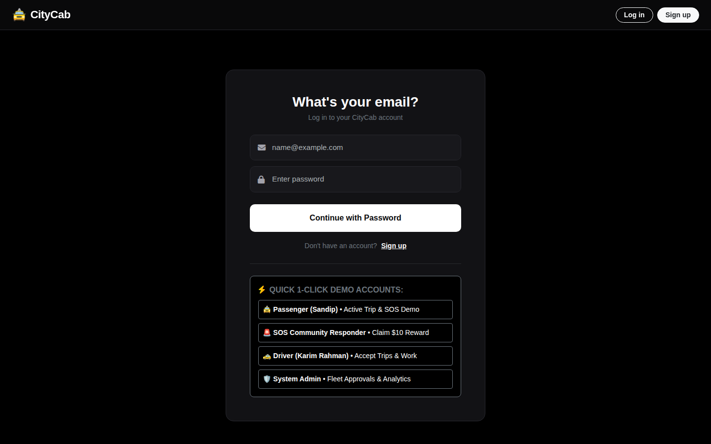
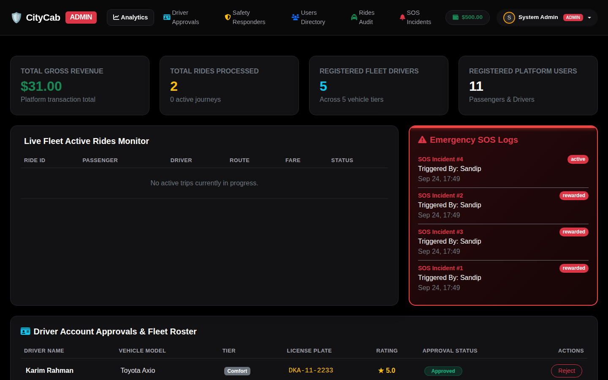
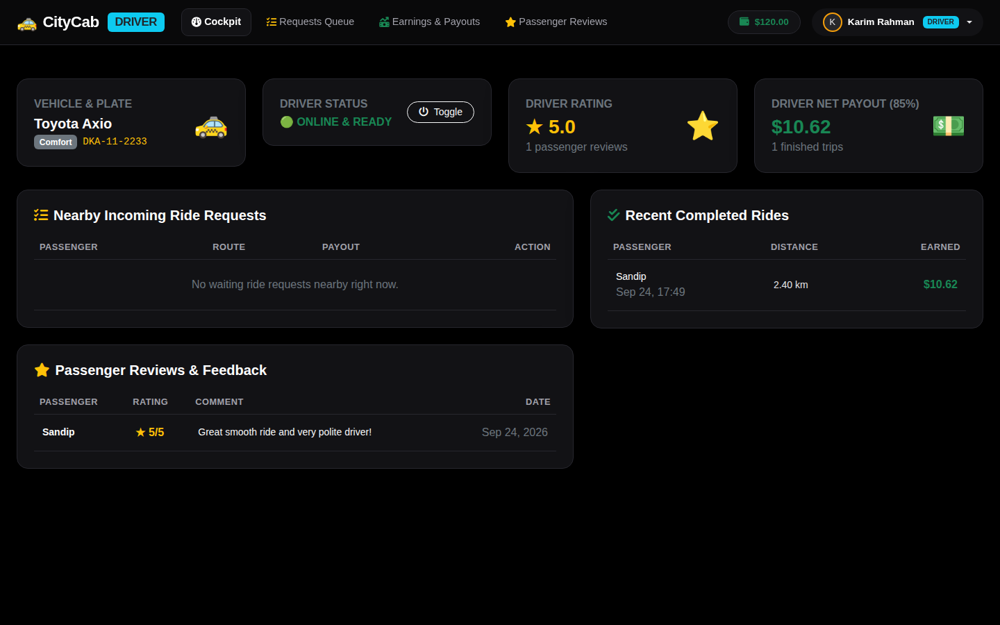
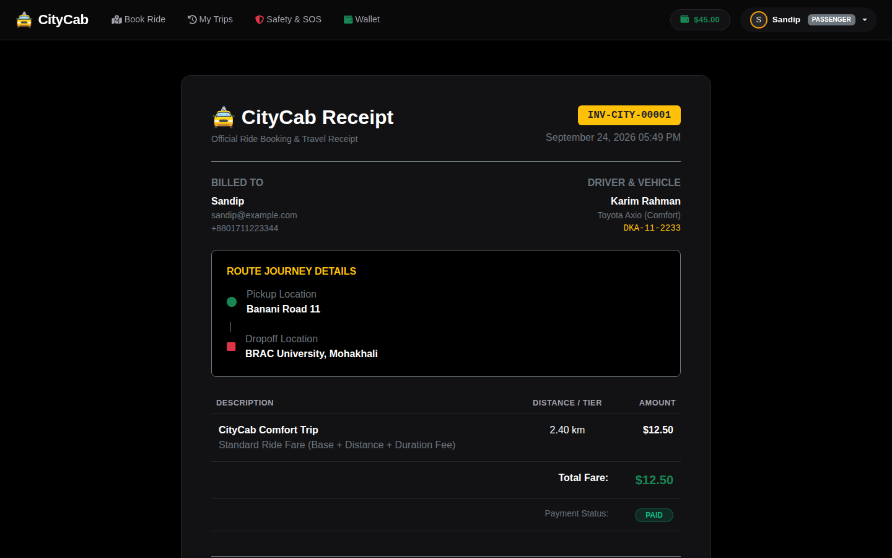
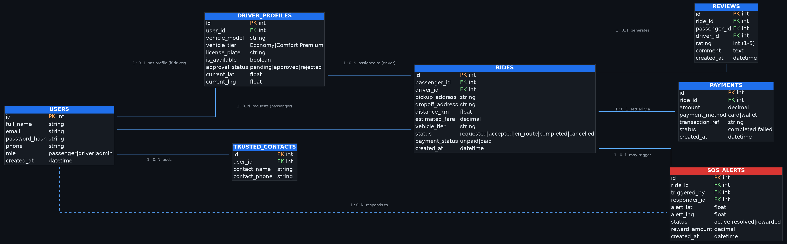

# 🚕 CityCab: Ride Booking & Safety Platform

[](https://github.com/sandipkumarpaul/CityCab-RideBooking-WebApp/actions/workflows/tests.yml)


CityCab is a full-stack ride-hailing web app set in Dhaka, Bangladesh. It has four roles (passengers, drivers, community safety responders and admins), each with its own dashboard. Passengers pick a route on a live map, compare fares across five vehicle tiers, watch their driver drive along real roads, pay through simulated bKash/Nagad/card gateways, and download PDF invoices. A built-in **SOS system** alerts trusted contacts and pays nearby community responders a reward for checking on a passenger in trouble.

I built it as a university web programming project.

**Live demo:** https://sandipkumarpaul.pythonanywhere.com

| Login with demo accounts | Admin analytics |
| --- | --- |
|  |  |
| **Driver cockpit** | **Ride receipt** |
|  |  |

## Features

**Passenger**
- Interactive Leaflet map with draggable pickup/drop-off pins, GPS "use my location", and address search (built-in Dhaka landmarks plus the OpenStreetMap Nominatim geocoder)
- Fare estimates for **Bike, CNG, Economy, Comfort and Premium** tiers, calculated from distance and estimated trip time
- Automatic driver matching: the nearest available, approved driver of the requested tier gets the ride
- Live trip simulation: the driver marker follows real road routes (OSRM) to pickup, then to the destination
- Wallet with top-ups and ride payments via simulated **bKash, Nagad, card or wallet** gateways
- Trip history, HTML receipts and downloadable **PDF invoices** (ReportLab)
- 1–5 star driver reviews
- Trusted emergency contacts and a one-tap **SOS** button

**Driver**
- Online/offline toggle, incoming request queue and accept flow
- Earnings view (drivers keep 85% of each fare) and passenger reviews

**Community responder**
- SOS radar map with every active emergency
- Claim a **$10 wallet reward** for checking on an incident. To prevent fraud, a responder has to be at least 1 km away when dispatched and can't claim a reward on their own alert.

**Admin**
- Revenue, ride, driver and user analytics
- Driver approval and rejection, user directory, full ride audit log, SOS incident log and a responder roster with rescue and reward totals

## Tech stack

| Layer | Tools |
| --- | --- |
| Backend | Python, Flask 3, Flask-Login, Flask-SQLAlchemy (SQLAlchemy 2) |
| Database | SQLite locally, PostgreSQL via `DATABASE_URL` |
| Frontend | Jinja2, Bootstrap 5 (dark theme), vanilla JavaScript, Font Awesome |
| Maps | Leaflet.js, OpenStreetMap tiles, OSRM routing, Nominatim geocoding |
| Other | ReportLab (PDF invoices), Werkzeug password hashing, Gunicorn |
| Testing / CI | pytest + unittest, GitHub Actions |

## Getting started

```bash
git clone https://github.com/sandipkumarpaul/CityCab-RideBooking-WebApp.git
cd CityCab-RideBooking-WebApp

python -m venv venv
source venv/bin/activate        # Windows: venv\Scripts\activate
pip install -r requirements.txt

python app.py                   # http://localhost:5000
```

On first launch the app creates `instance/citycab.db` and loads demo data. To reset the database to the demo state at any time, run `python seed.py`.

### Demo accounts

| Role | Email | Password |
| --- | --- | --- |
| Passenger | `sandip@example.com` | `pass123` |
| Responder | `responder@example.com` | `pass123` |
| Driver | `karim@citycab.com` | `driver123` |
| Admin | `admin@citycab.com` | `admin123` |

The login page also has one-click buttons that fill in these accounts.

### Configuration

All settings are optional environment variables. You can also put them in a `.env` file (see [`.env.example`](.env.example)).

| Variable | Default | Purpose |
| --- | --- | --- |
| `SECRET_KEY` | dev-only key | Flask session signing. **Set this in production.** |
| `DATABASE_URL` | `sqlite:///citycab.db` | Any SQLAlchemy URL (`postgres://` is handled too) |
| `CITYCAB_AUTO_SEED` | `1` | Load demo data when the database is empty |
| `PORT` | `5000` | Port for `python app.py` |

## Running tests

```bash
pip install -r requirements-dev.txt
pytest
```

The suite runs against an in-memory SQLite database, so it never touches your local data. It covers fare calculation, authentication and role-based access, the full booking → payment → review flow, SOS reward rules, PDF generation, every dashboard page, and authorization checks (for example, users can't read or pay for someone else's ride, and nobody can sign up as an admin).

## How it works

### Fare model

Each tier has its own base fare, per-km rate, per-minute rate, booking fee and minimum fare. Trip time comes from straight-line (Haversine) distance and a typical average speed for the tier:

```
fare = max(min_fare, (base + km × per_km + minutes × per_min + booking_fee) × surge)
```

| Tier | Base | Per km | Per min | Booking fee | Minimum |
| --- | --- | --- | --- | --- | --- |
| Bike | $1.20 | $0.85 | $0.10 | $0.50 | $3.00 |
| CNG | $2.00 | $1.20 | $0.15 | $0.80 | $4.00 |
| Economy | $3.00 | $1.50 | $0.25 | $1.20 | $5.00 |
| Comfort | $4.50 | $2.20 | $0.35 | $1.50 | $7.00 |
| Premium | $7.00 | $3.50 | $0.50 | $2.00 | $10.00 |

### SOS flow

1. During a ride, the passenger taps **SOS**. This creates an active alert at their location, and trusted contacts are notified (simulated SMS).
2. Every logged-in user can see active alerts on the responder radar.
3. A responder dispatched from **at least 1 km away** can verify the spot and receive a $10 wallet credit. Alerts can't be claimed twice, and passengers can't claim their own.

### Data model



Seven tables: `users`, `driver_profiles`, `trusted_contacts`, `rides`, `payments`, `reviews` and `sos_alerts`. Full definitions are in [`models.py`](models.py). The original UI wireframe is in [`docs/wireframe.png`](docs/wireframe.png).

### Main JSON endpoints

| Method | Endpoint | Description |
| --- | --- | --- |
| POST | `/api/estimate_fare` | Distance and fare for every tier |
| POST | `/api/request_ride` | Create a ride and auto-assign the nearest driver |
| GET | `/api/ride/<id>` | Ride details (passenger, driver or admin only) |
| POST | `/api/ride/<id>/status` | Update ride status |
| POST | `/api/driver/accept_ride/<id>` | Driver accepts a waiting request |
| POST | `/api/pay_ride` | Pay for a ride via bKash / Nagad / card / wallet |
| POST | `/api/submit_review` | Rate the driver (one review per ride) |
| POST | `/api/trigger_sos` | Raise an SOS alert for a ride |
| GET | `/api/active_sos_alerts` | Active alerts with distance and reward eligibility |
| POST | `/api/respond_sos/<id>` | Claim a responder reward |

## Project structure

```
├── app.py              # Flask app: config, routes, fare engine, JSON API
├── models.py           # SQLAlchemy models
├── seed.py             # Demo dataset (python seed.py to reset)
├── wsgi.py / Procfile  # Production entry points (PythonAnywhere / Gunicorn)
├── templates/          # Jinja2 pages for each role
├── static/
│   ├── css/style.css   # Dark theme
│   └── js/main.js      # Map, booking simulation, payments, SOS
├── tests/              # pytest suite
└── docs/               # ER diagram, wireframe, screenshots
```

## Deployment

- **Gunicorn / Heroku-style hosts:** the `Procfile` runs `gunicorn app:app`. Set `SECRET_KEY` and, optionally, `DATABASE_URL`.
- **PythonAnywhere:** point the WSGI config file at `wsgi.py`.

## Limitations & future work

Payments, SMS alerts and driver movement are **simulated**, and ride status updates use polling and page reloads. Ideas for next steps:

- Live GPS streaming and passenger–driver chat over WebSockets (Flask-SocketIO)
- Real payment gateway integrations (SSLCommerz, bKash Merchant API, Stripe) with webhooks
- Demand-based surge pricing
- Shared rides and multi-stop trips
- Native mobile apps with background location and push notifications
- CSRF protection and rate limiting before any real-world use
